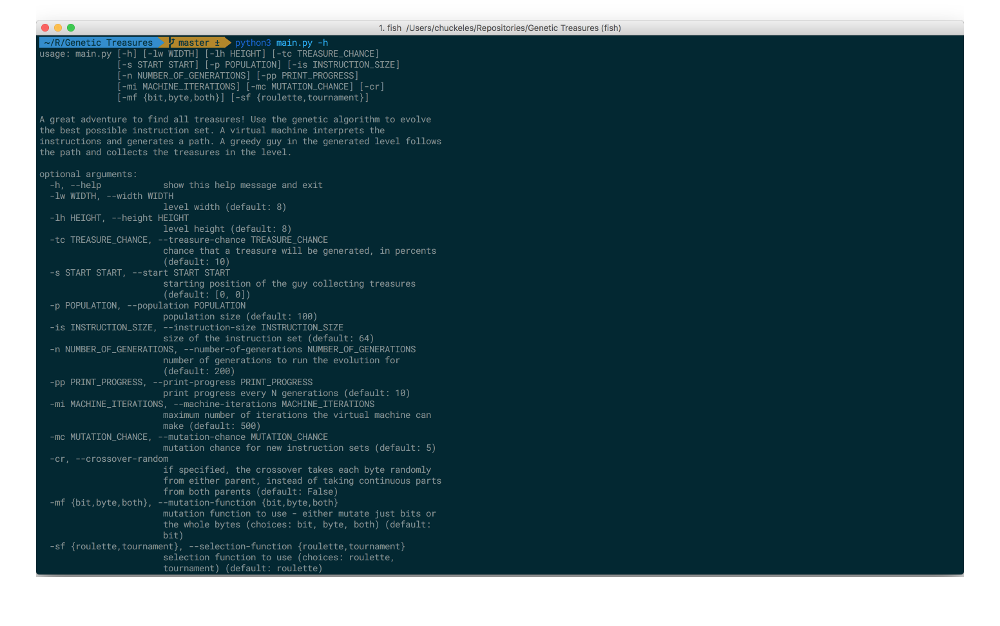
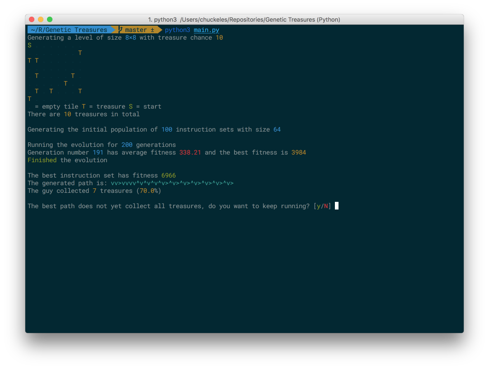
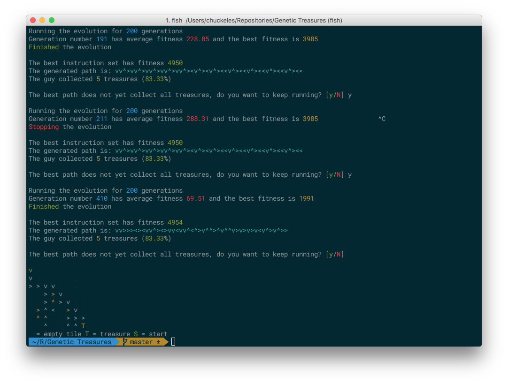
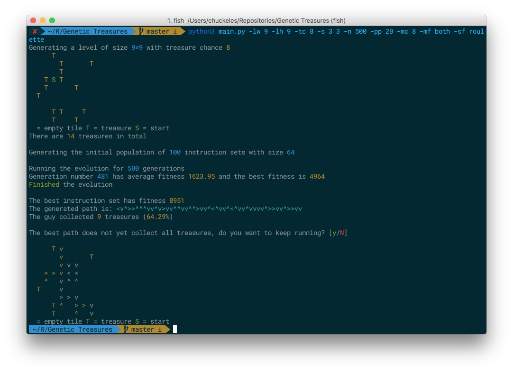
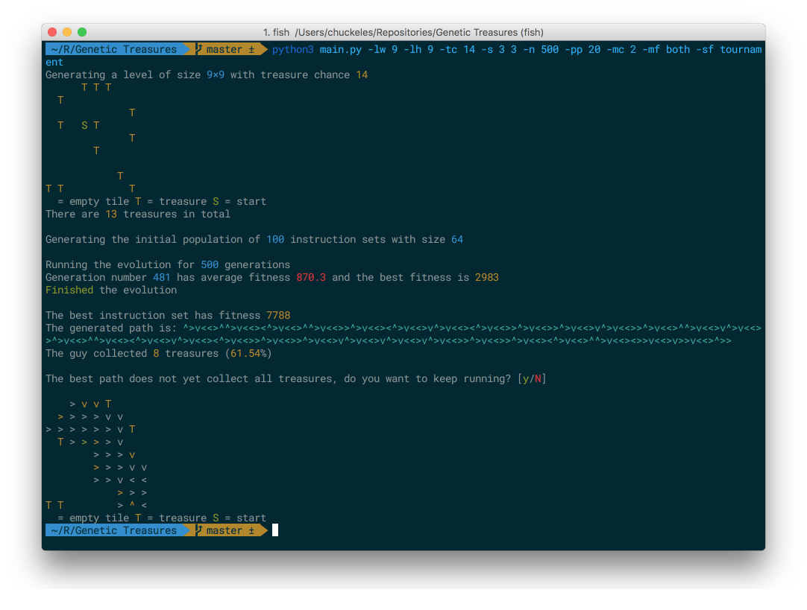
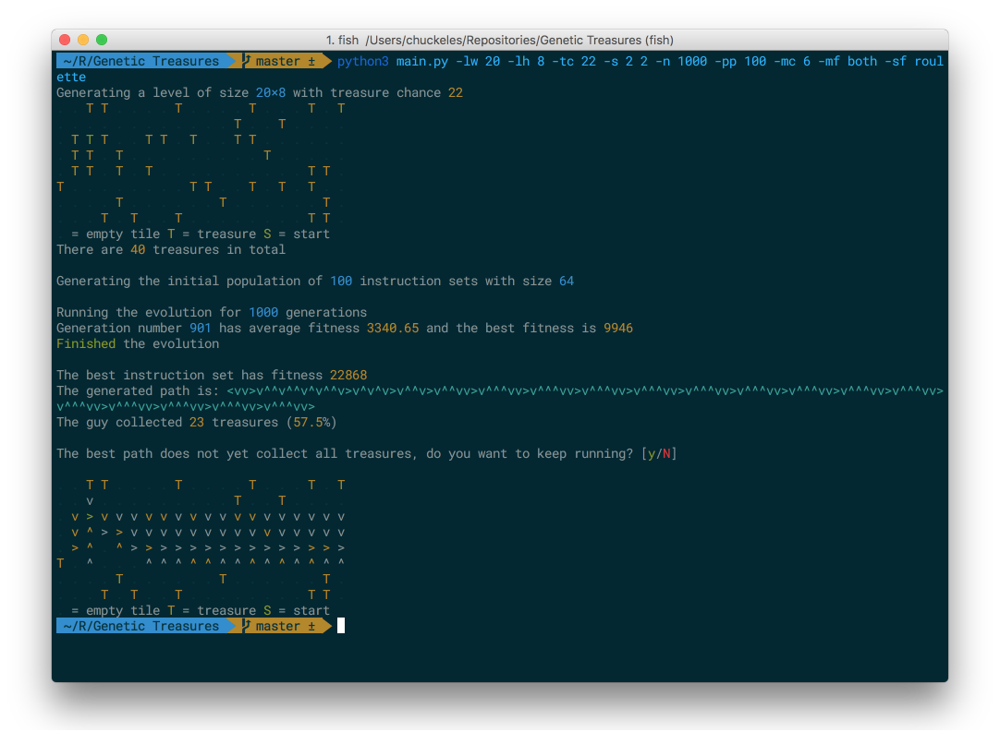
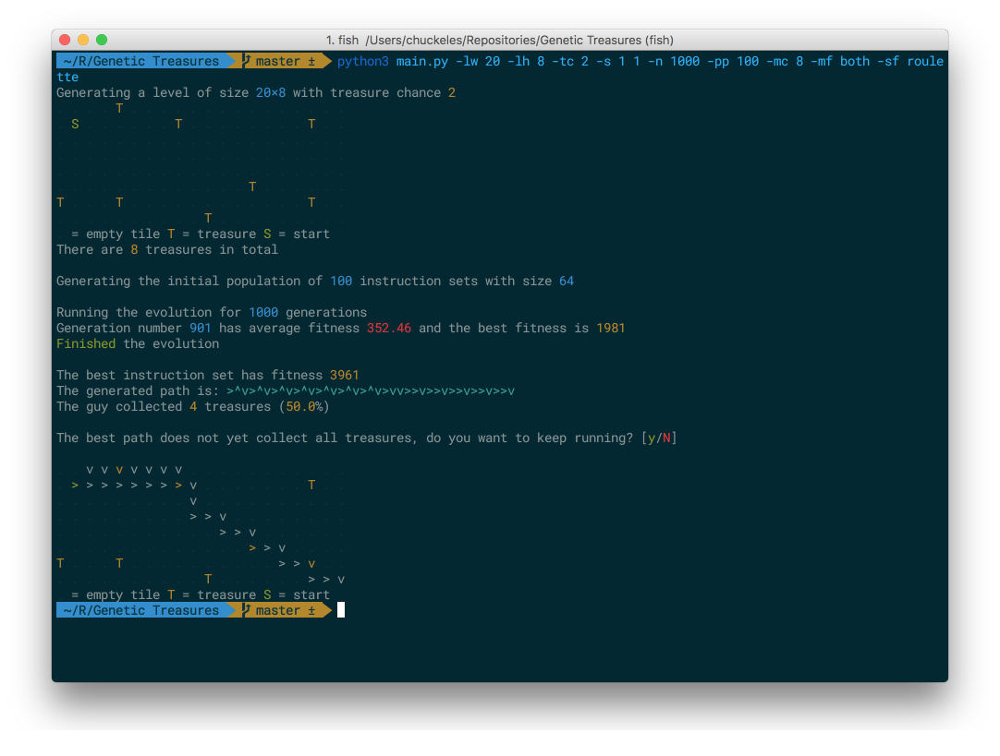

# Using genetic algorithms to find all treasures

This python program uses genetic algorithm to evolve an instruction set for a virtual machine that
executes them and creates a set of movement instructions for a guy that collects treasures on a
map.

## Configuration

The program has a lot of configurable options, as can be seen in the help.

They allow the user to configure the level, the population, as well as
select algorithms used by the program.

## Running the program

The program begins by generating the level and the initial population. Then, it
iteratively scores the population and evolves a new one. Progress is printed
to the console.

The program gives the user an option to keep evolving after the specified number
of populations. If the user selects `no`, the program prints the best generated
path and prints the path in the level.

## Initial population

The size of the initial population can be specified by the user. It is generated
randomly, i. e. the instruction sets are completely random. The size of the instructions
can be changed as well.

## Evolution

In each iteration, a new population is evolved from the previous one. This population
is then scored. After the specified number of iterations, the iteration stops. If all treasures
have been found, the program prints the best path and stops. Otherwise, the user is given
a choice to either continue evolving or to stop.

When evolving the new generation, these steps are taken:

1. Sort the whole population based on scores of the instruction sets.
2. Take the best third (⅓) of the population.
3. Produce the equal amount of children using the taken part of the population.
4. Generate random instruction sets to fill the remaining two thirds (⅔) of the population.
5. Return the new population. Its size is the same as the original population's size.

The algorithm used for selecting parents can be selected by the user. It is either
roulette or tournament. After the parents are selected, two children are produced
using crossover. The crossover selects a random point in the sets and takes the first
part from the first parent and the second part from the other. Alternatively, if
this option is specified by the user, each byte is taken by random from either parent.

Mutation is applied to both children after crossover. There are two mutations that can
take place and which one (or both) is used can be changed by the user. The first one
changes bits of the instruction sets and the other one swaps whole bytes with random bytes.

## Scoring

Each instruction set is taken by the virtual machine. The machine generates a path. This
path is then evaluated and the number of collected treasures is used as the scoring.
One thousandth is subtracted for each step taken.

The machine uses standard instructions described by the assignment – increment, decrement,
jump, print. When printing, the whole byte range is split into 4 segments, one for each
possible direction. The value of the byte is then used to check in which segment it falls and
the appropriate direction is then printed.

## Experiments

Tweaking the options can result in a large variety of generated paths and scores.
Here are some options used and the resulting score. Notice the different options passed
to the program and the final fitness value.

